# 🍲 Recipe Sharing Platform

A full-stack web application for sharing, saving, and rating cooking recipes. The platform supports multiple user roles (admin, author, user) and includes features like login, registration, recipe approval, comments with replies, reporting, and session-based authentication.

---

## 🔧 Technologies Used

- **Backend**: FastAPI (Python)
- **Frontend**: HTML, CSS, Jinja2 Templates
- **Database**: PostgreSQL
- **ORM/Adapter**: psycopg2
- **Session Handling**: Starlette SessionMiddleware
- **File Uploads**: `UploadFile`, image saving with `shutil`
- **Tools**: VS Code, Git, GitHub, pgAdmin

---

## ✅ Features

- 🧑‍💻 **User Authentication** for Admins, Authors, and Users
- 📝 **Authors** can add, edit their own recipes
- 📂 **Image Uploads** for recipe visualization
- ✅ **Admin Approval** & Disapproval of recipes and delete recipes
- 💬 **Comments**, ⭐ **Ratings**, and threaded **Replies**
- 🛑 **Comment Reporting** and **User Removal** based on reports
- 💾 **Save Recipes for Later** viewing
- 🔎 **Search Recipes** by title or category
- 📥 **Downloadable posts** and full **CRUD operations**
- 🔐 **Session-based role management**

---

## 🗂 Folder Structure

```
project/
├── main.py                 # Main FastAPI application
├── templates/              # Jinja2 HTML templates
├── static/                 # CSS, JS, images, and uploads
│   └── uploads/            # Uploaded recipe images
├── database/               # PostgreSQL database logic
└── venv/                   # Python virtual environment
```

---

## 🚀 Getting Started

### Clone the Repository
```bash
git clone https://github.com/Naveena-Krishnamurthy/recipe-sharing-app.git
cd recipe-sharing-app
```

### Create Virtual Environment and Install Dependencies
```bash
python -m venv venv
source venv/bin/activate  # or use venv\Scripts\activate on Windows
pip install -r requirements.txt
```

### Run the FastAPI Server
```bash
uvicorn main:app --reload
```

### Access the App
- Visit: `http://127.0.0.1:8000`
- Swagger Docs: `http://127.0.0.1:8000/docs`

---

## 👥 User Roles & Access

- **Admin**:
  - Login via `/login/admin`
  - Approve/disapprove recipes
  - Remove reported users
  - delete recipes

- **Author**:
  - Register/Login
  - Add/Edit recipes
  - Reply to comments

- **User**:
  - Register/Login
  - View & save recipes
  - Comment and rate
  - Report inappropriate comments

---

## 📸 Screenshots

_Add screenshots here after uploading to `/images` folder:_

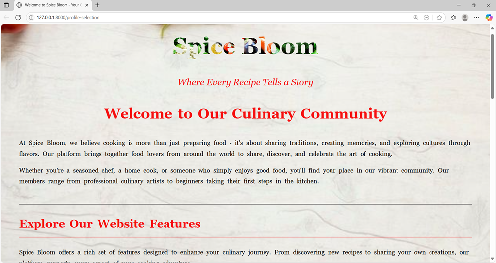
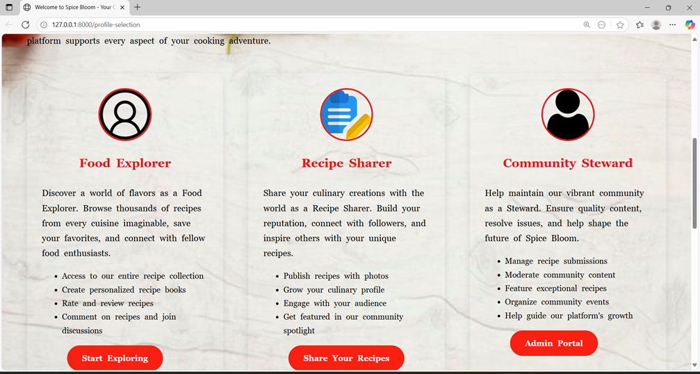
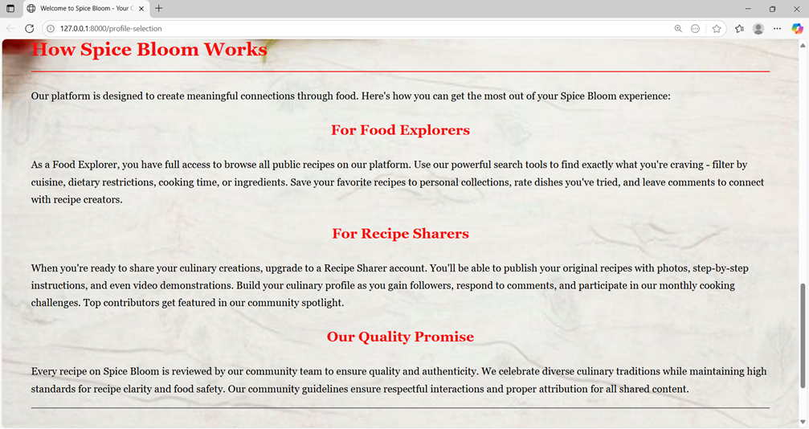
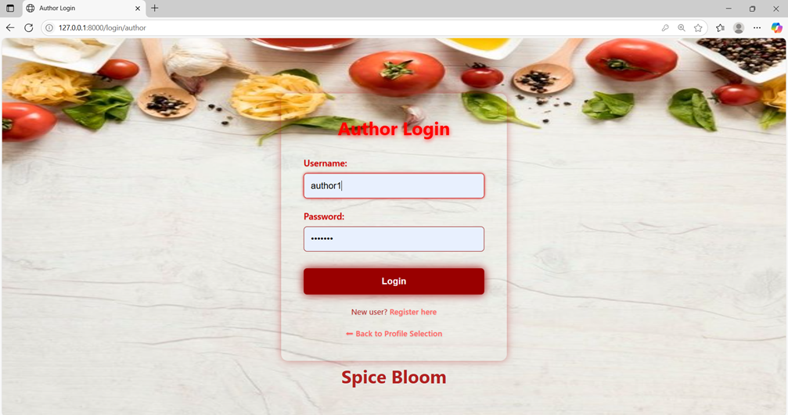
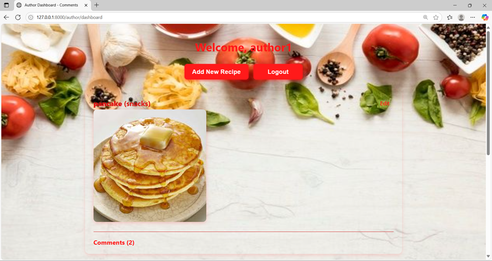
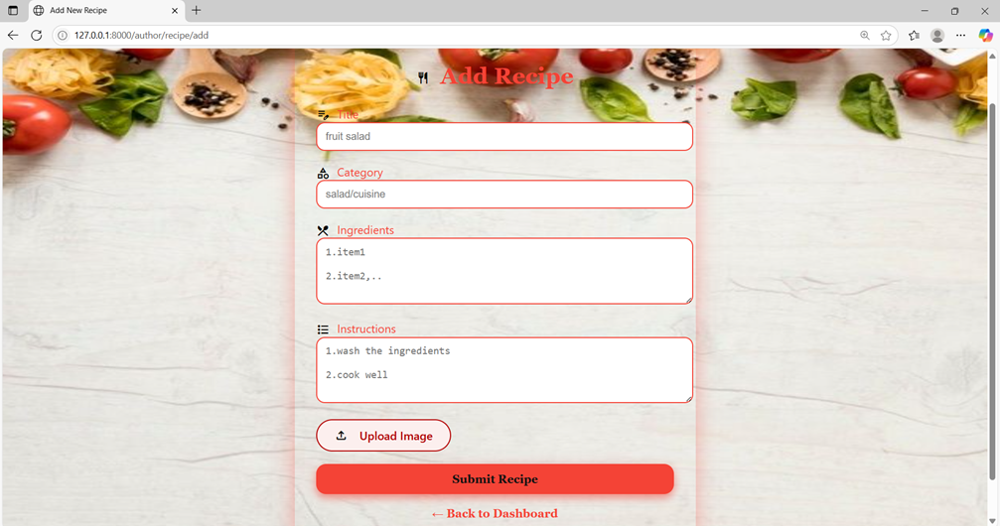
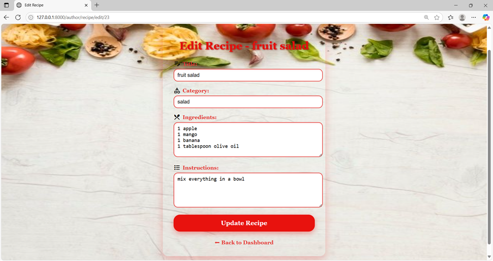
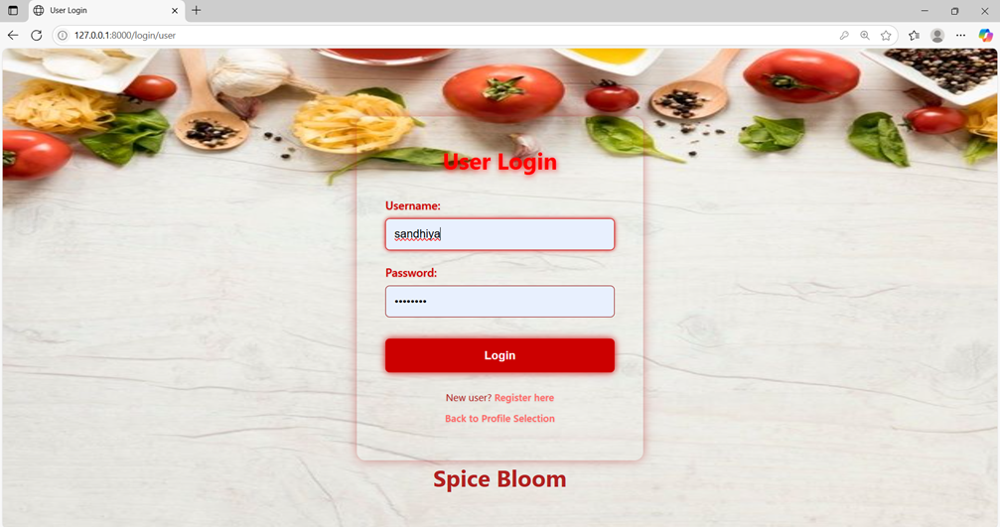
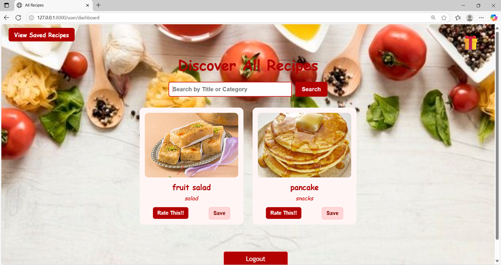
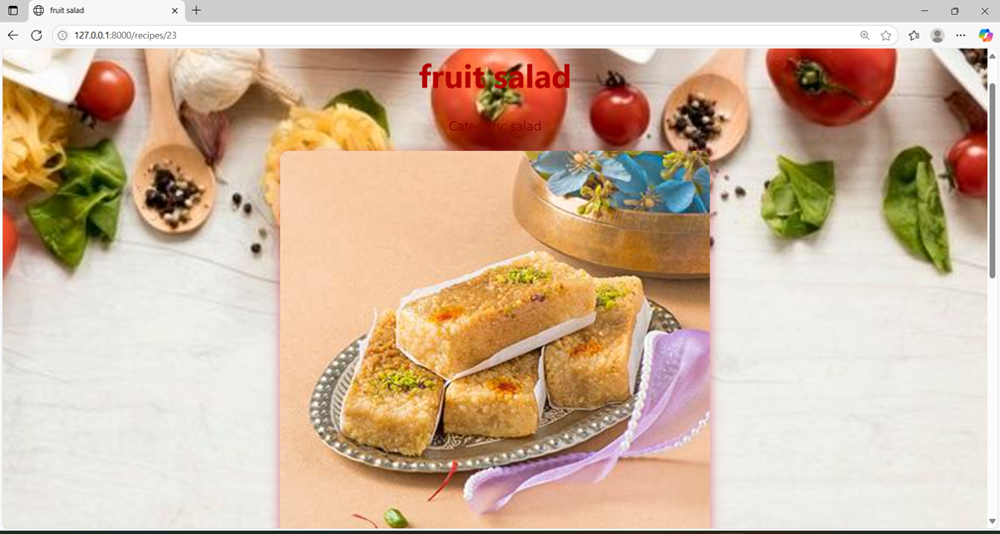
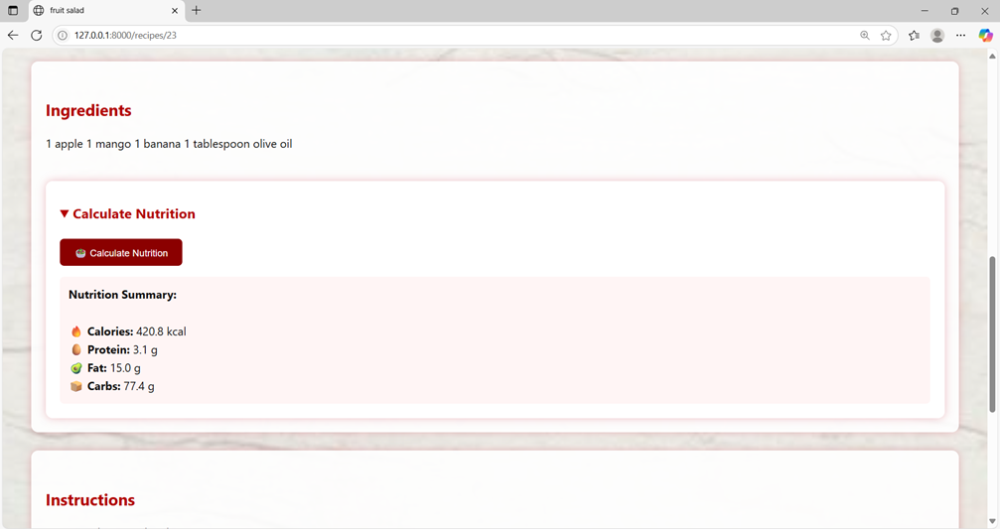

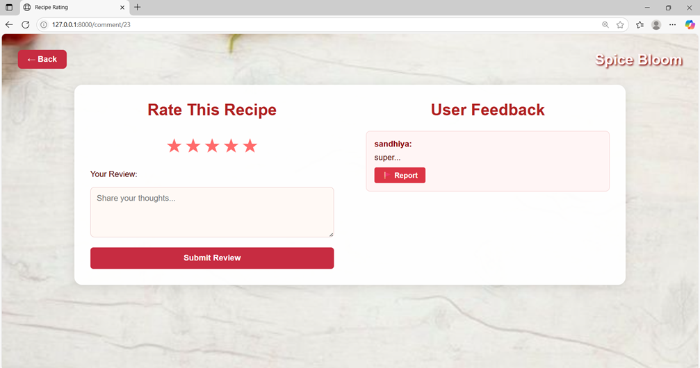

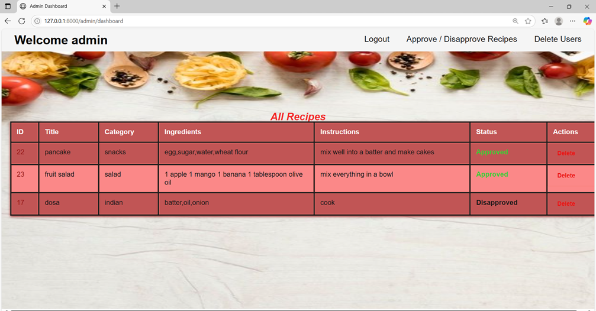
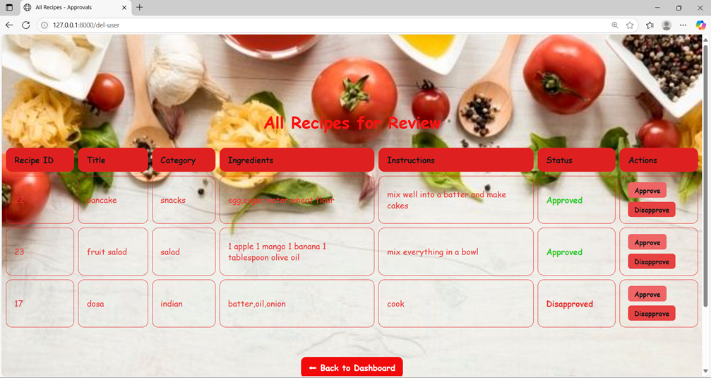
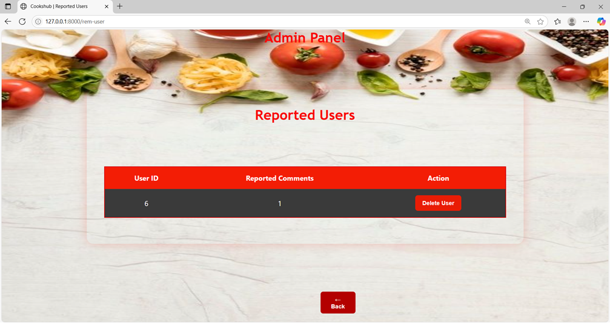

---

## 📌 Future Enhancements

- 🔔 Email notifications
- 📽 Recipe video support
- 🌐 Deployment (Render/Railway)
- 📱 Responsive design enhancements
- 🧠 AI-based recipe suggestions

---

## 🙋 Author

**Naveena Krishnamurthy**  
Internship Project – 2025  
[GitHub Profile](https://github.com/Naveena-Krishnamurthy)

---

## 📃 License

This project is licensed under the MIT License.
